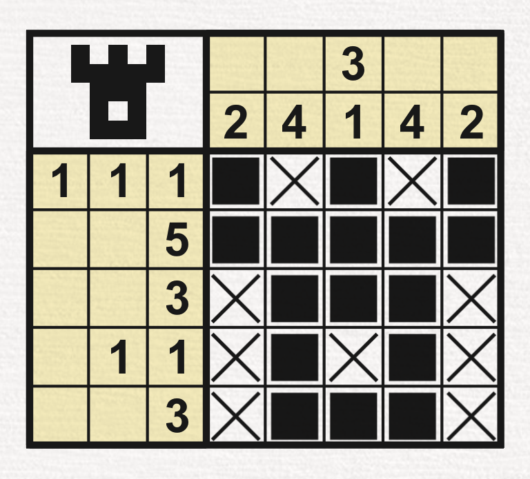
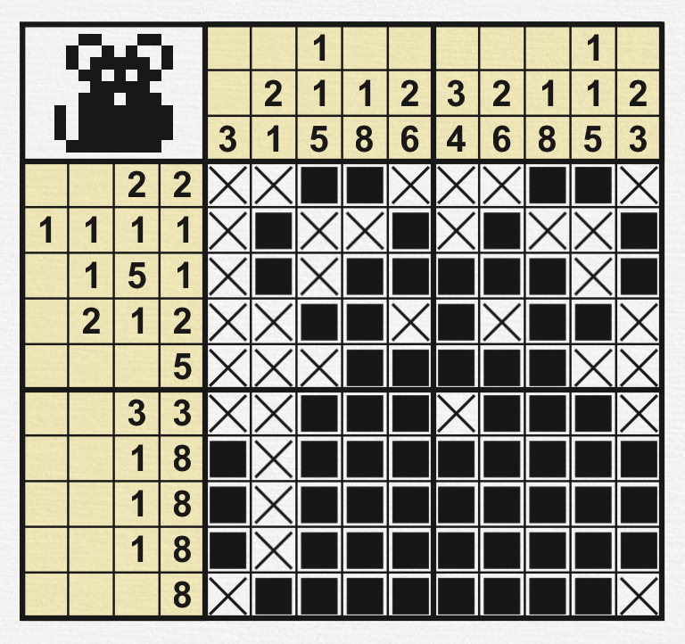
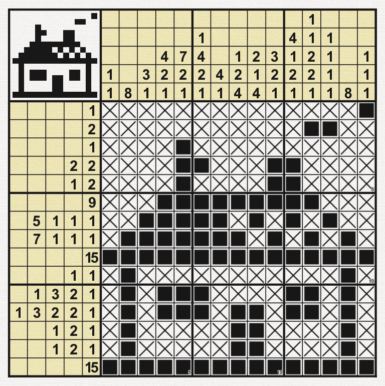

# Nonogram-SAT

## Poznámky
VELKE TODO: najit lepsi způsob na encoding než najít DNF a prehodit 

moznost: najit vsechny modely pro kazdy sloupec a radek a potom jednotlive udělat antimodely a z toho dostaneme CNF pro řádky a sloupce a z toho dokážeme po andování udělat CNF pro celou matici

jazyk: vsechna policka

1. sloupec:
```
3
big or 0...n-3
    p_i and p_{i+1} and p_{i+2}
    
potom DNF do CNF 
a and přes všechny sloupce a řádky
```

1. řádek:
```
2 2
big or 0...n-(2 + 1 + 2)
    p_i and p_{i+1} and (
        big or i+2...n-2
            p_j and p_{j+1}
```

# Zakódování problému

## Zakódování vstupu 

Každý Nonogram představuje čtvercovou matici, hrací plochu, $n \times n$. A ke každému řádku příslušící požadavky na vyplnění, viz příklady níže. Pro správné vyřešení Nonogramu je potřebné u každého políčka vyhodnotit, zda bude obarvené či ne. 

Nechť tedy hrací plocha představuje matici $A$, potom prvek $a_{ij}$ musí splňovat charakteristiku $i$-tého řádku a $j$-tého sloupce. 

Ukažme si příklad komentovaného zakódování na příkladu.



Tedy tento Nonogram velikost $5 \times 5$ bychom zakódovali následovně. Na prvním řádku se vždy objevuje informace o tom jaké má hrací plocha rozměry, díky tomu, že pracujeme s čtvercovými hracími poly, tak nám stačí uvést tuto hodnotu pouze jednou. 

Po informaci o rozměru přichází výčet informací nejdříve o sloupcích, zleva doprava, a následně o řádcích, shora dolů. Jednotlivá ohodnocení sloupců a řádků jsou vypsány podle stejné konvence a jsou odděleny mezerami. 

```
5
2
4
3 1
4 2
1 1 1
5
3 
1 1
3
```

## Zakódování do výrokové logiky

Pro zakódování Nonogramu do výrokové logiky je nejpřímočařejší nejdříve zakódování do DNF a následný převod. Poněvadž charakteristiky řádků a sloupců nám toto zakódování rovnou poskytnou. 

Tedy nechť je charakteristiky sloupce nebo řádku $3, 1$ a rozměry hrací plochy jsou $5 \times 5$, tedy charakteristika odpovídající 3. sloupci viz příklad výše. Tato charakteristika nám tedy říká, že v daném sloupci mu nastat, že začíná libovolným počtem neobarvených políček, klidně i nulový počet, následně mu nastat obarvená sekvence políček o velikosti 3, po této sekvenci musí pokračovat sekvence neobarvených políček, alespoň o velikosti 1 (abychom oddělily obarvené sekvence), následně obarvená sekvence o velikosti 1 a sloupec je ukončen libovolným počtem neobarvených políček, též může být o velikosti 0. A také musí platit, že součet velikostí těchto sekvencí je roven $5$. 

Pro zakódování do výrokové logiky použijme označení, že políčko $a_{ij}$ je obarvené právě tehdy, když $a_{ij} = 1$. A políčko je neobarvené pokud $a_{ij} = 0$. 

Tedy pokud je $(1,1,0,0,1)$ modelem $j$-tého řádku potom bude v DNF formule $a_{j0} \land a_{j1} \land \neg a_{j2} \land \neg a_{j3} \land a_{j4}$.

# Popis algoritmu

První část našeho algoritmu bude v spočívat v tom, že zakódujeme vstupní soubor do DNF dle popisu výše. Toto zakódování provedme pomocí rekurentního algoritmu dle následujícího pseudokódu: 

```
Pokud zpracována celá charakteristika:
    Přidej formuli do DNF
Jinak:
    Nastav formuli na pravdu pro delku aktualni části charakteristiky 

    Zavolej rekurzivní funkci s posunutým indexem charakteristiky 

    Deaktivuj nastavenou formuli na původní podobu
```

Pro převod námi vygenerovaného DNF do CNF můžeme použít 2 přístupy. 

První, najdeme všechny modly DNF a následně najdeme doplněk těchto modelů do modelu jazyka a z doplňku vytvoříme CNF. S tímto řešením je spojený problém, že pokud existuje pouze pár modelů, které by sloupec či řádek splňovali, tedy DNF je velmi malé, potom bude CNF téměř exponenciální k velikosti DNF. 

Druhým potenciálním řešením pro před do CNF je převod pomocí provádění ekvivalentních úprav, tedy spíše pomocí distribuce. Navzdory tomu, že by se mohlo zdát, že tento přístup bude výrazně obecně rychlejší a výhodnější než ten první, tak jsme při experimentaci narazil na to, že teoreticky komplexnější první případ běžel v podobném čase a za méně použité paměti, než druhý případ, tedy pomocí distribuce a ořezávání pomocí detekce tautologie ve formuli. 

Tedy ve finální implementaci jsem využil prvního případu s určitými optimalizacemi jako využití zakódování modelů do čísel atd. 

Dalším aspektem je fakt, že celá hrací plocha má rozměry $n \times n$, ale vždy zpracováváme jednotlivé řádky či sloupce jednotlivě a následně je spojujeme. Tedy výše popsané případy běží v nejhorším případě v asymptoticky exponenciálním čase vůči velikosti řádku, $n$, a ne velikosti matice $n \times n$.

# Příklady

## Small nonogram


### Encoding

```
5
2
4
3 1
4 2
1 1 1
5
3 
1 1
3
```

## Normal nonogram



### Encoding
```
10
3
2 1
1 1 5
1 8
2 6
3 4
2 6
1 8
1 1 5
2 3
2 2
1 1 1 1
1 5 1
2 1 2
5 
3 3
1 8
1 8
1 8
8
```

time: ~1.6 seconds

## Big nonogram



```
15
1 1
8
3 1
4 2 1
7 2 1
1 4 2 1
4 1
1 2 4
2 1 4
3 2 1
4 1 2 1
1 1 2 2 1
1 1 1 1
8
1 1 1
1
2
1
2 2
1 2
9
5 1 1 1
7 1 1 1
15
1 1
1 3 2 1
1 3 2 2 1
1 2 1
1 2 1
15
```